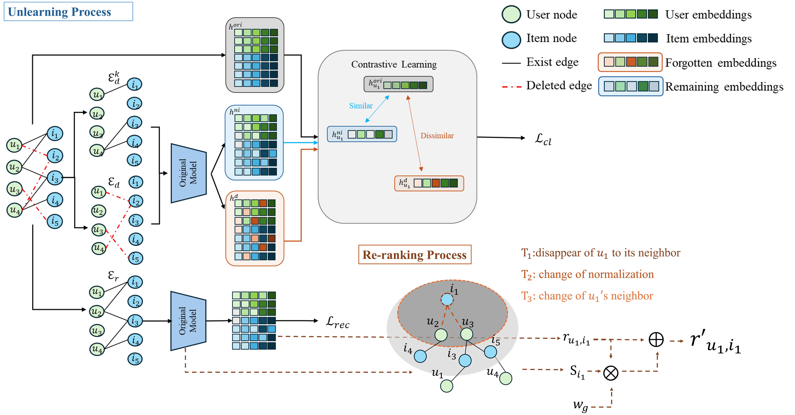

# RCU：Recommendation Contrastive Unlearning

#### Authors: 
- [Tzu-Hsuan Yang]() (tzuhsuan1010@gmail.com)

## Overview 
This repository contains the code to preprocess datasets, train GNN models, and perform unlearn on trained GNN models. We integrate contrastive learning into recommendation unlearning to enhance privacy protection, aligning with user rights and evolving privacy standards.
<p align="center">
    
</p>

## Datasets
Please run the following command to do train-test split. 
preprae_dataset.py for MovieLen100K, Douban, MovieLens1M. 
preprae_dataset_deg.py for AmazonBook. 
```
preprae_dataset.py
preprae_dataset_deg.py
```
## Requirements
The dataset used in RCU requires torch_geometric>=2.4.0. Please pay extra attention to this part.
```python
pip install numpy 
pip install pandas
pip install torch==1.13.1
pip install torch_geometric==2.4.0
pip install torch-cluster==1.6.1+pt113cu117
```
## Experimental setups-
To assess the trilemma of privacy, utility, and efficiency, we evaluate utility using three metrics: Precision@10 (P), Recall@10 (R), and NDCG@10 (N). For privacy, we compare the forgotten set with a randomly selected remaining set, assigning labels of 0 and 1, respectively, and calculate AUC and AUP to measure unlearning performance. Efficiency is measured by training time.

The first step is to train the original GNN model:  ``` python train_gnn.py```

After that, you can use different arguments for various unlearning tasks and experiments.

For example, if you want to unlearn 10% of high-degree users' edges in Douban, you can...
```
python delete_gnn.py --dataset Douban --gnn LightGCN --df high_user --df_size 10 --unlearning_model RecUn
```
else if you want to unlearn 10% of high-degree users' nodes in MovieLens100K, you can...
```
python delete_gnn.py --dataset MovieLens100K --gnn LightGCN --df high_user --df_size 10 --df_node True --unlearning_model RecUn
```
